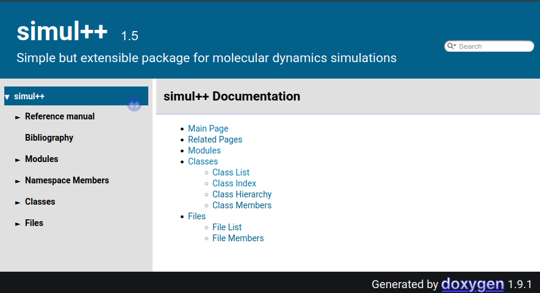

# simul++

#### Simple but extentensible package for molecular dynamics simulations

`simul++` is a simulation package written in C++. Primarily, it was designed for algorithm testing. As such, it is not optimized for speed. Rather, it should be easily extensible in terms of statistical ensembles, integration methods and interaction potentials.

Currently, classical unpolarizable particles can be simulated in the NVE, NVT or NPT ensemble using the standard Verlet-based integration methods as well as the Gear-like predictor-corrector integrators. Molecules can be defined by harmonic bonds and angles, cosine dihedrals or rigid bonds. Lennard-Jones potential is implemented for intermolecular interactions as well as electrostatics (cutoff or Ewald).

Verlet list and basic OpenMP parallelization are available to gain speed (at least a little).

Unfortunately, **documentation is missing** except for the following modules documented using Doxygen:

1. Mathematics (math folder)
2. Intermolecular interactions (system folder)
3. Intramolecular interactions (system folder)
4. Pair lists (system folder)
5. Quantities and measurement (only partially documented)

## Installation

The **easiest way to install** `simul++` is to run the bash script `install-simul++` in the `utils` folder. It creates `build` and `bin` folders and compiles the source files using CMake and g++. Standard compilation using CMakeLists.txt in the root folder should also work. For the available options, see the CMakeLists.txt file. Parallel version (using OpenMP) can be build by `install-simul++ -DPARALLEL=on` (you may need to clean the CMake cache by `install-simul++ -c`). The version of `simul++` can be checked by running it without parameters.

The **Doxygen documentation** can then be generated by the script `doxy-simul++`. Make sure you have defined the `$SIMULHOME` environment variable before. The documentation is then available upon opening `documentation/doxygen/html/index.html` in your browser.



## Requirements

- CMake (>3.1)
- g++ (or other C++11 compiler)
- make
- OpenMP (needed only for parallel version (not default))
- Doxygen (to create documentation)

## Running simulations

The input files are inspired by DL POLY 4 `FIELD`, `CONTROL` and `CONFIG`, whereas the output files are mostly in MACSIMUS-like format. To run a simulation, you must have (replace `simname` by any string) `simname.field` (force field – interaction definitions, description of atoms and molecules), `simname.control` (simulation parameters, see below) and `simname.config` (configuration – positions and velocities). Then, you can run the simulation using

```bash
simul++ simname
```

Convergence profiles are in `simname.cpa` in a readable CSV-like format (with spaces as delimiters), trajectories are either in the MACSIMUS `.plb` format or in the DL POLY `.history` format. The final configuration is written to `.configfinal`, which has the same structure as `.config`. The simulation protocol `.prt` is in the Markdown format and provides detailed information about the simulation system and a brief overview of the integration method used.

In the `case_studies` folder, there are a couple of examples to see what is possible.

## Directives in `.control`

- **ensemble** – define the statistical ensemble, possible options are (for more info please consult the source code):
  
   - **ensemble nve** – the default, microcanonical ensemble
   - **ensemble nvt berendsen tauT** – Berendsen thermostat (friction thermostat) with the thermostat constant tauT (should be float number in ps)
   - **ensemble nvt nose tauT** – Nosé–Hoover canonical ensemble, thermostat constant tauT (float in ps)
   - **ensemble npt berendsen tauT tauP** – Berendsen thermostat with a friction barostat, thermostat constant tauT, barostat constant tauP (both floats in ps)
   - **ensemble npt nose tauT tauP** – Nosé–Hoover (MTK) isothermal–isobaric ensemble, thermostat constant tauT, barostat constant tauP (both floats in ps)
   - **ensemble ntvinit berendsen tauT taurho** – custom *ensemble* for initialization, Berendsen thermostat with box size changing to reach the final density (**rho** directive) in taurho ps

- **integrator** – define the integration method, possible options are:
  
   - **integrator verlet** – the default integrator, activates the standard algorithms (MTTK for Nosé thermostat and barostat)
   - **integrator alejandre** – for NPT Nosé–Hoover activates the TALJM algorithm, otherwise the same as **verlet**
   - **integrator verlet trvp2** – Verlet with time-reversible velocity predictor, activates MACSIMUS-like algorithms for NVT and NPT ensembles, **trvp2** can be replaced by higher order **trvp3**,...
   - **integrator verlet iter2** – Verlet with 2 iterations for NVT and NPT ensembles, the number of iterations can be increased by **iter3**, **iter4**,...
   - **integrator k4m2e** – Gear-like integrators implemented according to the universal framework (see `documentation/Gear_formalism_for_MD.pdf`, there also a list of possible interators) 

- **ljcutoff** – cutoff for Lennard-Jones interactions (in Å)

- **vdwmixing lorentz-berthelot** – activate Lennard-Jones cross terms (no need then to state them explicitly in the `.field` file)

- **elstat** – defines the calculation of electrostatic interactions (default is no electrostatics):
  
   - **elstat cutoff cutvalue [alpha]** – cutoff electrostatics (MACSIMUS-like smoothing), **cutvalue** is the cutoff distance in Å, **alpha** (optional) is a smoothing parameter (default is 0.7, see `CutoffElstat.cpp` for details)
   - **elstat ewald cutvalue [alpha kappa]** – Ewald summation (within a sphere in the reciprocal space), **cutvalue** is the cutoff distance in Å, **alpha** and **kappa** are parameters of Ewald, default values π/cutvalue

- **shake tolerance [omega]** – **tolerance** is a relative tolerance for rigid bonds treated by SHAKE, optional **omega** defines desired overrelaxation

- **steps** – number of integration steps

- **timestep** – integration time step in ps

- **temperature** – desired temperature in K (for thermostats and initialization of velocities (see **init**)

- **rho** or **density** – desired density in kg/m³ (for ntvinit ensemble)

- **pressure** – desired pressure in Pa (for barostats)

- **playback** – dump trajectory to a `.plb` file, interval (frequency of dumping) in ps needed (e. g. **playback 0.1**)

- **history interval keytraj** – dump trajectory to a `.history` file, **interval** in ps, **keytraj** specifies the level of information (0 means positions only, 1 positions & velocities, higher derivatives possible up to the `Rsize` of the integrator used)

- **dump** – dump files needed to restart the broken simulation, interval (frequency of dumping) in ps needed (e. g. **dump 10.0**)

- **stats** – interval of measurement in ps (e. g. **stats 0.01**)

- **measure** – add (or delete) quantities to the list of measured quantities (default given by the **ensemble** used), possible values are (use - before the quantity to delete it):
  
   - **Tkin, Tin, Ttr** – kinetic, internal and translational temperature
   - **Etot, Epot, Ekin** – total (including **Eextra**), potential and kinetic energy 
   - **Elj, Eelst, Ebond, Eangle, Edih, Eelin, Eextra** – energy of Lennard-Jones interactions, electrostatic interactions (intermolecular), bonds, angles, dihedrals, intramolecular electrostatic interactions, energy of the extra degrees of freedom (Nosé-like ensembles)
   - **rho, V, P, PVVC** – density, volume, pressure (from virial), pressure from virtual volume change
   - **vir, virconstr, virbond, virangle, virdih, virLJ, virelst** – virial of forces – total, constraint forces, bonds, angles, dihedrals, LJ interactions, electrostatic interactions
   - **MaxErrC, MaxAngleC, maxShakeIter** – maximum error of rigid bonds, maximum deviation of rigid bond and atom velocity angle from π/2, maximum number of SHAKE iteration per step
   - **nopairs** – number of atom pairs on the Verlet or all-pair list
   - ... – see `system/incl/Quantities.hpp`
  
  e. g. **measure -Tin Eelst PVVC maxShakeIter -V**

- **init** – defines initialization procedure, possible options are:
  
   - **continue**
      - append measurement, playback and history
      - based on restart (what applies for restart, applies here also)
      - no check of atom numbers, measured quantities etc. – use cautiously
   - **restart**
      - all info from `.config`, but do not append measurement and playback/trajectory
      - old accelerations used if present (forces calculated only to measure quantities, shake also only for virconstr (can be suppressed by `no initshake`))
      - default
   - **scalevel**
      - as restart scale in DL POLY - positions from `.config`, velocities from `.config` rescaled according to **temperature**
   - **randomvel**
      - use only postions from `.config` assign random velocities based on **temperature**

- **pairlist** – pairlist for intermolecular interactions
  
   - **pairlist all** – the default all-pair list (no optimization of intermolecular interactions, all pairs are checked each step)
  
   - **pairlist verlet outercut** – Verlet list, atom pairs within **outercut** (relatively to **ljcutoff** or **elstat cutoff**) are considered, new list is made whenever any atom travels by more then a half of **outercut** − **cutoff**, reasonable values of **outercut** are [1.05, 1.5]

- **scale14 vdw14 [elstat14]** – scaling for 1–4 intramolecular interactions, **vdw14** scaling for dispersive (LJ) interactions, **elstat14** (optional, if not given then equal to **vdw14**) scaling for intramolecular electrostatic interactions

- **nfold i j k** – replicate the system in `.config` file
  
   - **i** replicas in the x direction, **j** in the y directions, **k** in the z direction
  
   - number of atoms in the `.field` file must be thus i·j·k times the number of atoms in `.config` file
  
   - useful to generate initial configurations (in conjunction with **ensemble ntvinit berendsen**)

- **no** directives – turn off selected corrections:
  
   - **no cutoffcorr** – do not add cutoff corrections (caused by van der Waals interactions beyond cutoff) to potential energy and pressure
  
   - **no pressurecorr** – do not add kinetic pressure correction (one atom pressure to the kinetic part of pressure in case of 0 total momentum)
  
   - **no elstatshift**, **no elstatenergyshift**, **no elstatforceshift** – do not shift potential (forces or both) in the real part of electrostatics (primarily for Ewald r-space, but applicable also to cutoff electrostatics)
